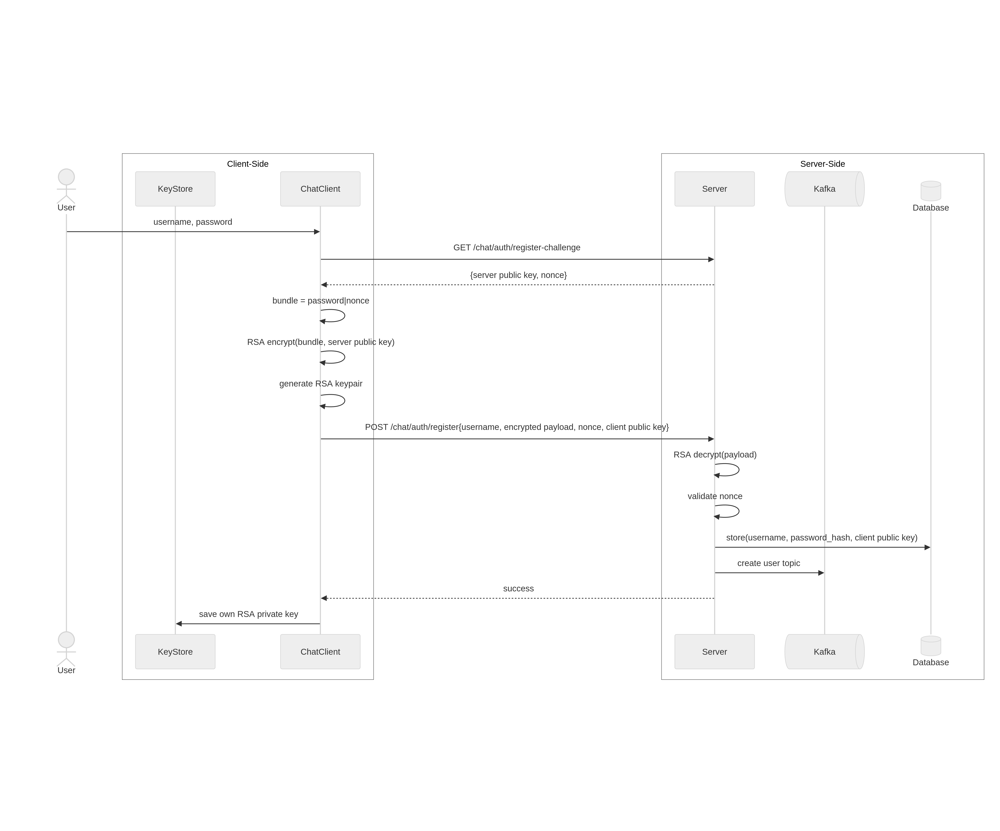
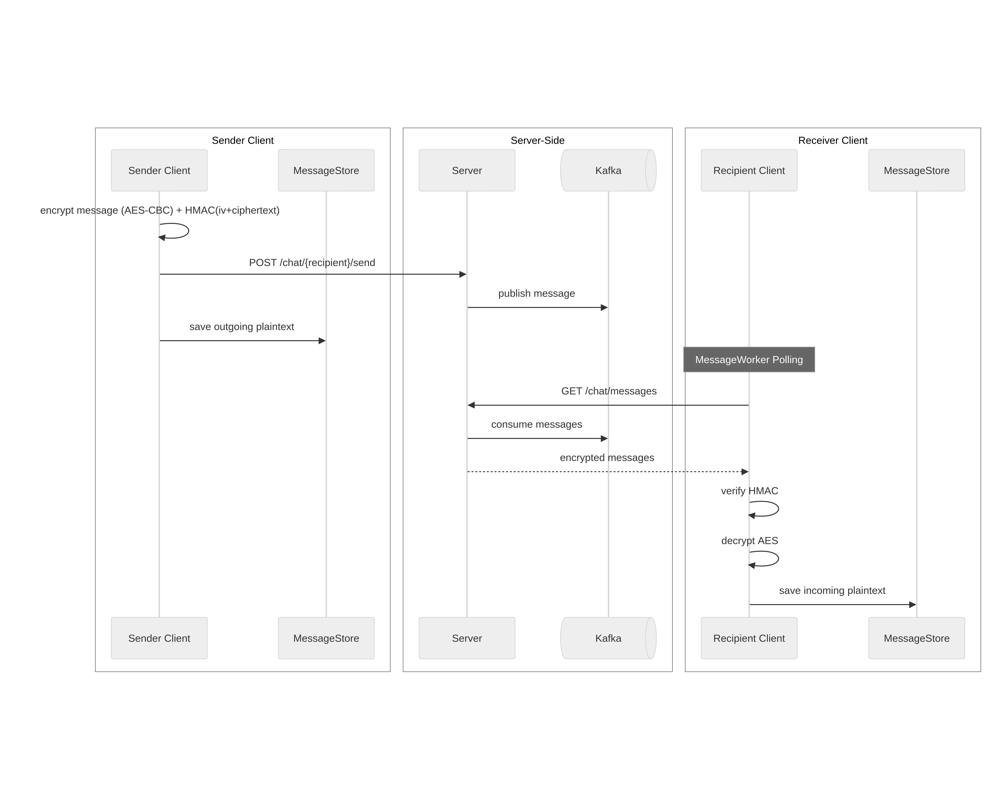

# Secure Chat

A secure command-line chat application using **RSA (Public-Key)** and **AES (Symmetric-Key) encryption**.

- **Frontend:** Textual CLI
- **Backend:** FastAPI
- **Messaging:** Apache Kafka (dedicated queues per user for messages and keys)
- **Database:** SQLite (SQLAlchemy)

---

## Setup

### 1. Running the Server
1. Navigate to the server directory: `cd src/server`
2. Build the image: `docker-compose build`
3. Start the service: `docker-compose up`

### 2. Running the Client
1. Open a new terminal window
2. Navigate to the projects src directory: `cd src`
3. In order for the client to run, the necessary Python dependencies inside the `requirements.txt` need to be installed first. Install them with: `pip install -r requirements.txt`
4. Then start the chat: `python3 tui.py` or `python tui.py`

There are no test users provided but a new user can simply be created by registering him with a username and password in the chat interface.

> **Note**: It is recommended to use a python virtual environment for the client execution and installation of the dependencies.

> **Note:** Multiple client interfaces can be executed and tested in parallel. For that simply open a new terminal window for each user you want to check, navigate to the `src` folder, run `python tui.py` and log in with a different user.

## Security Architecture

1. **Challenge-Response Auth:** Login and Registration use RSA-encrypted challenges to verify identity without sending raw passwords over the wire.
2. **HMAC Request Signing:** All protected endpoints require an `X-Request-Signature`. Requests are signed using a session key via HMAC-SHA256 to ensure integrity and prevent tampering.
3. **Replay Protection:** All signed requests must include an `X-Request-Timestamp` valid within a 30-second window.
4. **End-to-End Encryption (E2EE):** Chat messages are encrypted with symmetric AES keys, which are exchanged between users via RSA encryption.

---

## Communication & Security Flows

The system implements a multi-layered security architecture utilizing `RSA-2048` for identity/key exchange and `AES-256-CBC` with `HMAC-SHA256` for message confidentiality and integrity. Below are the sequence flows for main operations in the application.

### 1. User Registration
Registration establishes the user's identity. The client generates a local RSA key pair and uploads the public component to the server's directory. A server-side nonce is used to protect the password during the initial registration.

### 2. Challenge-Response Authentication
To prevent credential sniffing and replay attacks, the login process uses a three-way handshake. The server issues an encrypted challenge that can only be decrypted by the holder of the account's private key.

### 3. Symmetric Key Establishment
The system uses Lazy Key Establishment. A 256-bit AES symmetric key is generated locally by the sender when the first message is initiated. This key is encrypted using the recipient's RSA Public Key and transmitted via a dedicated Kafka key-exchange topic.

### 4. End-to-End Encrypted Messaging
Once a shared secret exists, messages are encrypted using AES-CBC. To ensure integrity and prevent tampering (or padding oracle attacks), an HMAC-SHA256 tag is computed over the IV and ciphertext. The server and Kafka act as stateless transporters, never possessing the keys required to decrypt the payload.

---

## Server API Endpoints

### Authentication & Registration

#### `GET /chat/auth/register-challenge`
**Get registration requirements**
- **Returns:** Server's RSA public key and a unique registration nonce.

#### `POST /chat/auth/register`
**Register a new user**
- **Parameters:**
    - `username`
    - `public-key`: User's RSA public key.
    - `nonce`: The nonce from the challenge.
    - `payload`: Hex-encoded RSA bundle containing `hashed_password|nonce` (encrypted with Server's public key).

---

#### `POST /chat/auth/login-challenge`
**Phase 1 of Login**
- **Parameters:** `username`
- **Returns:** A challenge string encrypted with the **User's** public key.

#### `POST /chat/auth/login`
**Phase 2 of Login**
- **Parameters:** - `username`
    - `challenge_response`: The decrypted nonce from the challenge.
    - `proof`: HMAC-SHA256(nonce, password_hash).
- **Returns:** `session-key` (encrypted with the user's RSA public key).

---

> **Note:** All endpoints below require the following headers for HMAC verification:
> - `X-Request-Signature`: `HMAC_SHA256(session_key, "body|timestamp")`
> - `X-Request-Timestamp`: ISO-8601 string.

---

### Session Management

#### `POST /chat/auth/logout`
**Revoke session**
- **Returns:** Clears the active `session_key` for the user.

---

### Users & Presence

#### `GET /chat/users`
**List users**
- **Returns:** Array of users including their `online` status.

#### `POST /presence`
**Heartbeat**
- **Description:** Updates the `last_seen` timestamp for the authenticated user.

---

### Key Exchange (E2EE)

#### `GET /chat/{username}/publickey`
**Fetch recipient's key**
- **Returns:** The RSA public key of the target user.

#### `POST /chat/{username}/keyexchange`
**Send symmetric key**
- **Parameters:** `encrypted_key` (The AES key encrypted with the recipient's RSA public key).
- **Behavior:** Pushes the key to the recipient's dedicated key-exchange Kafka topic.

#### `GET /chat/keyexchange`
**Retrieve pending keys**
- **Returns:** List of encrypted symmetric keys sent to you by other users.

---

### Messaging

#### `GET /chat/messages`
**Retrieve chat messages**
- **Behavior:** Fetches all pending messages from the user's Kafka queue (`user_queue_{username}`).
- **Returns:** Array of message objects (sender, encrypted payload, timestamp).

#### `POST /chat/{username}/send`
**Send message**
- **Parameters:** `message` (The AES-encrypted ciphertext).
- **Behavior:** Routes the message to the recipient's Kafka queue.

---